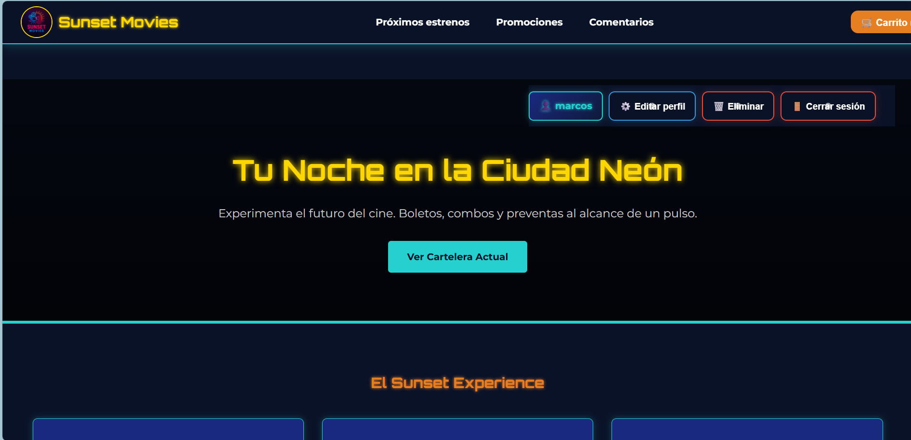
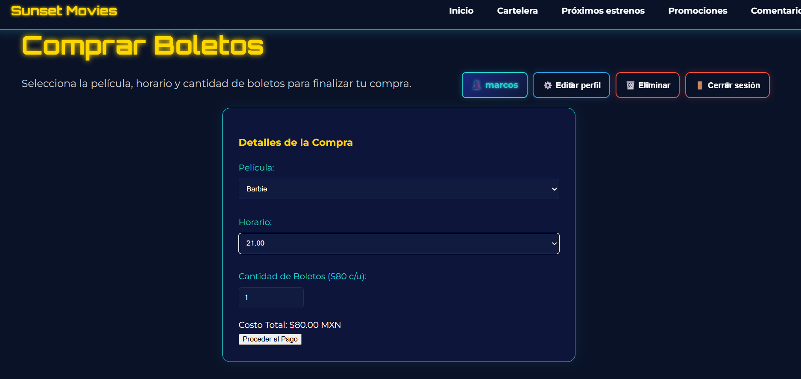
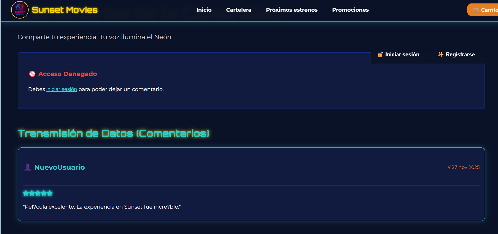
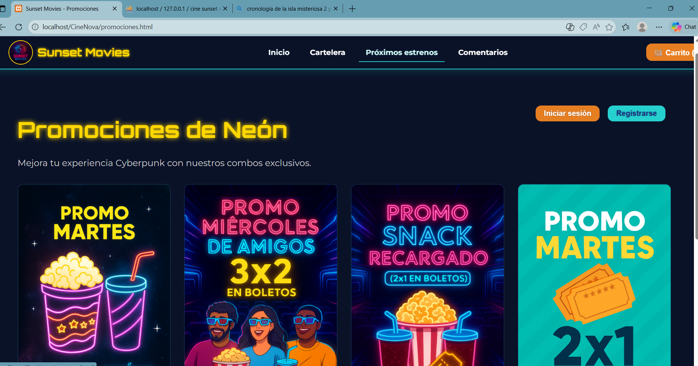

% Sunset Movies — Briefing para Presentación
% olvera10723-maker
% 2025-12-11

---

# Portada

Sunset Movies — Briefing de Producto y Sitio Web  
Experiencia Neón / Compra de Boletos & Promociones

Notas del presentador:
- Presentarse brevemente.
- Objetivo: mostrar la propuesta, funcionalidades clave, métricas y próximos pasos.

---

# Resumen Ejecutivo
- Propósito: permitir ver cartelera, comprar boletos, gestionar cuenta y comprar promociones.
- Público objetivo: jóvenes adultos (18–40) aficionados al cine y experiencias premium.
- Estado: MVP funcional con autenticación, carrito local y API PHP (/CineNova/api/*).

Notas del presentador:
- 30–45s: por qué es valioso (estética + UX + facilidad de compra).

---

# Propuesta de Valor
- Experiencia visual distintiva (estética cyberpunk / neón).
- Flujo de compra sencillo (boletos + historial).
- Comunidad (comentarios con calificación).

Notas del presentador:
- Enfatizar retención y conversión apoyadas por el diseño.

---

# Estructura Principal del Sitio
- index.html (inicio)
- cartelera.html (ver películas)
- boleto.html / comprar_boletos.html (flujo de compra)
- estrenos.html (próximos estrenos)
- promociones.html (combos y carrito)
- Comentarios.html (comunidad)

Notas del presentador:
- Componentes comunes: userBar, modales (login/register), cartModal, styles.css.

---

# Flujo de Usuario: Comprar un Boleto

1. Ver cartelera → seleccionar película → ir a boleto.html
2. Seleccionar horario y cantidad; costo dinámico (precio por defecto $80)
3. Crear compra via api/crear_compra.php (requiere sesión)

Notas del presentador:
- Validaciones cliente: selección película/horario, cantidad.
- Manejo respuestas servidor (ok / no autenticado / error).

---

# Flujo de Usuario: Registro y Gestión de Cuenta
- Registro: modal → api/register.php
- Login: modal → api/login.php (cookies, credentials: 'include')
- Perfil: editar (api/actualizar_usuario.php), eliminar (api/borrar_usuario.php)

Notas del presentador:
- Confirmar contraseña para eliminación; uso de sesiones con cookies.
- Recomendación: validar contraseñas, usar HTTPS, CSRF.

---

# Comunidad y Comentarios

- Enviar comentario con calificación (api/agregar_comentario.php)
- Listar (api/listar_comentarios.php)
- Editar/Borrar por autor (api/editar_comentario.php, api/borrar_comentario.php)

Notas del presentador:
- Riesgos: moderación, spam; sugerir paginación y filtros.

---

# Promociones y Carrito

- Promociones en promociones.html
- Carrito persistente en localStorage (clave: cineNovaCart)
- Checkout de promociones simulado (mensaje); boletos registrados en servidor

Notas del presentador:
- Recomendar sincronizar carrito local con servidor al login.

---

# Diseño Visual y Activos
- Paleta: cian neón, oro, naranja, fondo oscuro.
- Tipografías: Orbitron (títulos), Montserrat (cuerpo).
- Recursos: carpeta images/ (posters, logo, capturas), trailers.

Notas del presentador:
- Recomendación: optimizar imágenes (WebP), comprimir assets, usar CDN si escala.

---

# Arquitectura Técnica (resumen)
- Frontend: HTML + JS estático (páginas).
- Backend: PHP (endpoints en /CineNova/api/).
- Sesiones: cookies + credentials: 'include'.
- Almacenamiento cliente: localStorage (carrito).
- Endpoints claves: me/login/register/logout, crear_compra/listar_compras, comentarios (agregar/listar/editar/borrar).

Notas del presentador:
- Recomendación: API consistente RESTful, validaciones en servidor, logging.

---

# Métricas y KPIs sugeridos
- Conversión boletos: % visitas → compra
- Abandono en formulario de compra
- Retención: usuarios recurrentes / compras por usuario
- Engagement: comentarios y calificación promedio
- Rendimiento: LCP, TTFB

Notas del presentador:
- Integrar GA4 + eventos personalizados (click comprar, añadir carrito, login).

---

# Riesgos y Recomendaciones
- Riesgos:
  - Endpoints inseguros (inyección, auth)
  - Carrito local vs servidor (inconsistencia)
  - Comentarios sin paginación (escalabilidad)
- Recomendaciones:
  - Forzar HTTPS, sanitización server-side, CSRF tokens
  - Persistencia del carrito en servidor / sincronización
  - Moderación/paginación para comentarios

Notas del presentador:
- Priorizar seguridad y fiabilidad.

---

# Roadmap (3 sprints sugeridos)
- Sprint 1 (2 semanas): Auditoría de seguridad, HTTPS, validaciones servidor.
- Sprint 2 (3 semanas): Persistencia de carrito en servidor, integración pasarela de pago (sandbox).
- Sprint 3 (3 semanas): Analytics, UX (selección de asientos), optimización de assets.

Notas del presentador:
- Entregables y criterios de aceptación por sprint.

---

# Recursos y Anexos
- Archivos clave: styles.css, boleto.html, comprar_boletos.html, Comentarios.html
- Instrucciones para demo local y pruebas

Notas del presentador:
- Preparar demo en vivo y Q&A al final.

---

# Cierre / Preguntas
- Mensaje final: potencial de marca + próximos pasos técnicos y de negocio.
- Contacto: olvera10723-maker

Notas del presentador:
- Abrir espacio para dudas y priorización.
